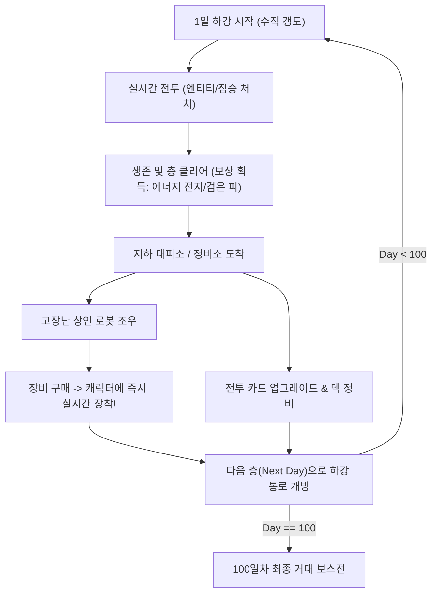

# [GDD] 100 Days Below (심연의 100일)
> **장르**: 수직 하강형 호러 아케이드 로그라이크 + 카드 덱빌딩  
> **컨셉**: 100일(100단계) 동안 지하로 내려가며 괴물들을 처치하고, 장비와 카드를 업그레이드하여 100일째 심연의 거대 보스를 격파하는 게임

---

## 1. 게임 개요 및 핵심 루프

### 1.1 기본 정보
- **목표**: 매일 한 층(1단계 = 1일)씩 어두운 지하 수직 갱도를 하강하여 총 100일 동안 생존하고, 100일째에 존재하는 심연의 핵(거대 보스)을 섬멸.
- **시점 및 비주얼**: 2D 탑다운(Top-down) 또는 수직 스크롤 아케이드. CRT 스캔라인, 어둡고 차가운 인더스트리얼/바이오 호러 픽셀 아트, 극단적인 명암 대비(다이내믹 2D 라이팅).
- **로그라이크 규칙**: 영구 사망(Permadeath). 사망 시 1일 차로 귀환하지만, 특정 영구 해금 요소(설계도, 기억 조각)가 다음 회차에 도움을 줌.

### 1.2 핵심 게임 루프


---

## 2. 캐릭터 및 장비 장착 시스템 (핵심 메커니즘)

### 2.1 플레이어 캐릭터 기본 스탯
- **HP (생명력)**: 0 도달 시 사망.
- **Sanity (정신력/이성)**: 어둠 속에 오래 있거나 공포 엔티티를 마주치면 감소. 낮아질수록 화면 왜곡, 헛것(가짜 적) 출현, 조준 흔들림 발생.
- **Battery (조명 배터리)**: 시야 반경을 유지하는 에너지. 바닥나면 좁은 시야만 남고 피습 위험 급증.
- **Scrap / Black Blood (고철 / 검은 피)**: 상점 거래 및 카드 업그레이드에 사용되는 2종 재화.

---

### 2.2 장비 슬롯 및 실시간 캐릭터 장착 (Equipment & Modular Visuals)
플레이어가 상점에서 장비를 구매하면 **즉시 캐릭터에게 장착(Equip)**되며, 외형과 공격 방식이 실시간으로 변합니다.

#### A. 장비 슬롯 구분
1. **주무기 (Primary Weapon - 오른손/전방)**
   - 기본 공격 모션과 주력 투사체/참격을 결정.
   - *예시*:
     - `휴대용 채굴 드릴`: 근접 초고속 연타, 적 관통 및 밀쳐내기.
     - `개조된 화염방사기`: 부채꼴 범위 지속 화염, 좁은 통로 봉쇄 특화.
     - `압축 충격 샷건`: 원뿔형 넉백 탄환, 방어막 파괴.
     - `생체 산성총`: 적을 중독시키고 방어구를 녹이는 유기물 무기.
2. **보조장비 (Sub-Equipment - 왼손/어깨)**
   - 보조 공격 및 유틸리티 기능.
   - *예시*:
     - `강화 전기 충격기`: 접근하는 적 일시 기절.
     - `어깨 장착형 투광등`: 정면 시야각 대폭 확장 및 빛에 약한 적 약화.
     - `체인 작살기`: 원거리 적을 끌어당기거나 벽에 고정.
3. **신체 외골격 / 방어구 (Body Armor & Exoskeleton)**
   - 외형 실루엣을 크게 바꾸며, 이동속도, 방어력, 상태이상 저항력 제공.
   - *예시*:
     - `용접공 중장갑`: 넉백 면역, 물리 피해 40% 감소, 이동속도 -15%.
     - `스텔스 나노 슈트`: 정지 시 은신, 회피율 +25%, 어둠 속 이동속도 증가.
     - `괴수 키틴질 갑각`: 짐승의 살점으로 엮은 갑옷. 피격 시 주변에 가시 반사.
4. **코어 파츠 (Power Core / Relic)**
   - 캐릭터 등 뒤에 부착되는 에너지 팩. 특수 오라 및 파티클 이펙트 방출.

#### B. 장비 구매 시 장착 프로세스 (In-Game Workflow)
```
[상점 인터랙션] 
   └── 아이템 선택 및 구매 확정
          ├── 1. 스탯 갱신: 공격력, 사거리, 방어력, 특수 패시브 즉시 적용
          ├── 2. 모듈러 스프라이트 결합: 캐릭터 베이스 스프라이트에 장비 부착 (소켓 기반)
          ├── 3. 이펙트 활성화: 무기 구동음, 스파크, 조명 광원 변화
          ├── 4. 카드 시너지 활성화: 해당 무기와 연동되는 전용 카드가 덱에 추가/강화
          └── 5. 기존 장비 처리: 기존 착용 장비는 분해되어 고철 환급 또는 배낭 보관
```

---

## 3. 전투 카드 시스템 (Card Deckbuilding)

전투 중 플레이어는 실시간 아케이드 이동/조작을 하면서 화면 하단에 충전되는 덱 카드를 사용하여 강력한 기술과 전술을 펼칩니다.

### 3.1 카드 분류 및 메커니즘
- **마나/스태미나 시스템**: 전투 중 시간 경과 및 적 처치 시 '신경 펄스(Pulse)'가 충전되어 카드를 발동.
- **카드 유형**:
  - **[공격 (Assault)]**: `급소 찌르기`, `난사`, `과부하 방전`, `살점 절단`
  - **[방어/생존 (Survival)]**: `긴급 회피`, `연막 분사`, `신경안정제 투여`, `배터리 과충전`
  - **[전술/제어 (Tactics)]**: `음파 교란`, `냉각 덫 설치`, `중력 붕괴 탄`, `괴물 유인 페로몬`
  - **[변이 (Mutation)]**: 자신의 HP나 이성을 소모하여 화면 전체에 파괴적인 피해를 입히는 금기 카드.

### 3.2 층간 카드 업그레이드
- 매 층 클리어 후 지하 대피소의 **[신경 단말기]**에서 수행:
  - **강화 (Upgrade)**: 대미지 증가, 쿨타임 감소, 펄스 소모량 감소.
  - **변형 (Mutate)**: 기본 카드에 속성 부착 (예: `급소 찌르기` + `방사능 오염`).
  - **정제 (Purge)**: 덱의 비효율적인 카드를 제거하여 드로우 순환 최적화.

---

## 4. 고장난 상인 로봇: '녹슨 브로커' (The Rusted Broker)

### 4.1 캐릭터 콘셉트
- 과거 지하 시설의 자동 보급 안드로이드였으나, 100일간의 지하 붕괴와 괴물들의 공격으로 머리 절반이 박살 나고 내부 전선이 타버린 상태.
- 깜빡이는 녹색 CRT 모니터 얼굴, 글리치 노이즈, 종잡을 수 없는 괴상한 말투.
- 플레이어가 살아서 내려올 때마다 감탄하면서도 위험한 장비들을 판매함.

### 4.2 대사 및 인터랙션 예시
> *"치..치직... 안녕... 고객님? 아..직 살점이... 붙어있군요? 훌륭한... 내구성입니다."*  
> *"이번... 상품은... 드릴입니다... 뼈를 갈아낼 때... 진동이 아주... 쾌적..치직!"*  
> *"경고: 이 무기는... 전 주인의... 뇌수를... 조금... 머금고 있습니다. 30% 할인!"*

### 4.3 상점 특별 기능: [불안정한 개조 & 저주받은 거래]
- **저주받은 장비**: 파격적으로 높은 공격력을 가졌으나 시야를 절반으로 깎거나 피격 시 광기를 유발하는 장비.
- **장비 과부하 인챈트**: 고철을 주고 현재 장착한 장비에 무작위 특수 효과 부여 (실패 시 소량의 스파크 피해).

---

## 5. 100일 스테이지 구성 및 생태계 (Progression)

난이도는 25일 주기로 테마와 적 생태계, 환경 기믹이 급변합니다.

| 구간 | 환경 테마 | 주요 적 (엔티티 & 짐승) | 환경 위험 요소 |
| :--- | :--- | :--- | :--- |
| **Day 1~25** | **상층 폐광 & 배수로** | 감염된 쥐 떼, 동굴 거머리, 침식된 광부 엔티티 | 낙석, 얕은 침수 구역 (이동속도 저하) |
| **Day 26~50** | **버려진 생체 연구소** | 배양관 탈출체, 자폭성 포자 괴수, 부식액 분사자 | 독가스 밸브, 간헐적 정전 (완전 암흑) |
| **Day 51~75** | **자동화 기계 묘지** | 오염된 절단 드론, 폭주 중장갑 워커, 융합 사이보그 | 고전압 누전 타일, 자동 레이저 포탑 |
| **Day 76~99** | **심연의 살점 동굴** | 차원 왜곡체, 환각 유발자, 무형의 그림자 포식자 | 바닥 살점 촉수, 이성 급속 소모 지대 |
| **Day 100** | **심연의 핵 (최하층)** | **[FINAL BOSS] 심연의 지배자 - 베히모스** | 맵 붕괴, 전방위 탄막 및 촉수 |

---

## 6. 100일차 최종 보스: 심연의 지배자 (The Abyssal Behemoth)

지하 100층 전체를 차지하고 있는 거대한 유기체-기계 융합 괴수. 3단계에 걸쳐 전투가 진행됩니다.

```
[Phase 1: 잠복한 거신]
- 화면 상단/하단을 가득 채운 거대한 얼굴과 두 개의 거대 분쇄 팔.
- 패턴: 지면 강타 충격파, 수직 레이저 브레스, 잡몹 엔티티 대량 소환.
- 공략: 양팔의 관절 약점을 장착 무기와 카드로 집중 파괴.

[Phase 2: 노출된 기계 심장]
- 외피가 파괴되며 고압 전류와 붉은 살점이 뒤엉킨 거대 코어 노출.
- 패턴: 맵 전역 산성비 낙하, 심장 박동 파동(플레이어 조작 반전/스턴), 자폭 촉수 소환.
- 공략: 코어의 방어막이 풀리는 타이밍에 과부하 공격 카드 연계.

[Phase 3: 광폭화된 심연 (붕괴)]
- 보스가 맵 전체를 집어삼키려 하며 지하 공간이 아래로 무너져 내림.
- 패턴: 제한 시간(산소/붕괴 타이머), 무작위 바닥 붕괴, 피할 수 없는 전방위 탄막.
- 공략: 100일 동안 축적한 최종 장착 장비와 강화 카드의 모든 화력을 쏟아부어 섬멸.
```

---

## 7. 아트 & 사운드 디렉션
- **시각**: 
  - 16비트 스타일의 거친 픽셀 아트 + 최신 2D 다이내믹 섀도우(Light2D / Normal Map).
  - 장비 장착 시 캐릭터 스프라이트 실시간 교체 및 발광(Glow) 효과.
- **청각**:
  - 배경음: 불길한 기계 저주파 웅웅거림, 축축한 발소리, 멀리서 들려오는 괴성의 앰비언스.
  - 효과음: 무거운 타격음, 로봇의 지지직거리는 스파크 소리, 심장 박동 소리.
