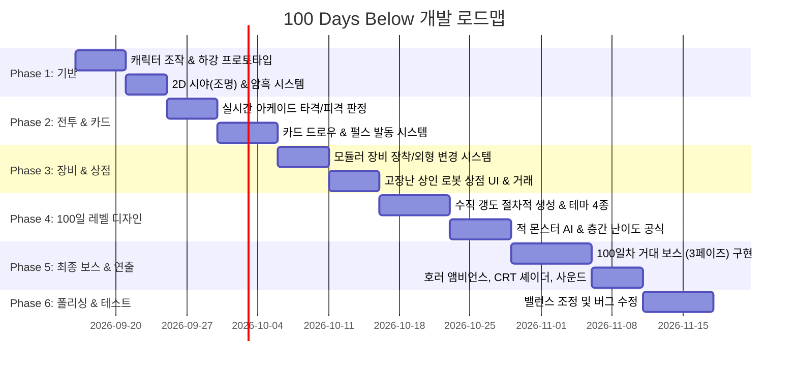

# [DEV PLAN] 100 Days Below - 개발 로드맵 및 구현 계획서

본 문서는 `design.md`에 명시된 **100일 생존 수직 하강형 호러 아케이드 로그라이크** 게임의 실제 개발 로드맵, 아키텍처 설계, 데이터 모델 및 단계별 구현 가이드를 정의합니다.

---

## 1. 기술 스택 및 개발 환경 권장안

| 구분 | 추천 옵션 A (독립 엔진) | 추천 옵션 B (경량 웹/프로토타입) |
| :--- | :--- | :--- |
| **엔진 / 프레임워크** | **Godot 4.x (GDScript / C#)** | **TypeScript + Phaser 3 / PixiJS** |
| **선정 이유** | - 뛰어난 2D 라이팅/섀도우 시스템 지원 (공포 분위기 구현 용이)<br>- 씬(Scene) & 노드 기반의 모듈러 장비 장착 구조 구현 최적화 | - 브라우저 즉시 구동 및 테스트 접근성<br>- 가벼운 2D 아케이드 액션 개발 속도 |
| **렌더링** | 2D Pixel Art + CanvasModulate (암흑 효과) + PointLight2D | WebGL 2D 스프라이트 + 셰이더 조명 |
| **상태 관리** | Custom Event Bus + Resource / ScriptableObject | Redux-like State Machine or Observer 패턴 |

---

## 2. 핵심 시스템 아키텍처 & 데이터 구조

### 2.1 캐릭터 및 장비 장착 모듈러 시스템 (Equipment Socket System)
장비 구매 시 캐릭터에게 즉각 장착되고 외형이 변하는 구조를 위한 노드/컴포넌트 설계:

```
[Player Entity]
  ├── KinematicBody / CharacterController (이동, 물리 충돌)
  ├── BaseSprite (캐릭터 기본 신체 픽셀 애니메이션)
  ├── [Equipment Sockets] (부착점 노드들)
  │     ├── Socket_PrimaryHand  ──> WeaponSprite & MuzzlePoint (장착 무기)
  │     ├── Socket_SubHand      ──> SubItemSprite (보조 장비)
  │     ├── Socket_BodyArmor    ──> ArmorOverlaySprite (외골격/방어구 덧씌우기)
  │     └── Socket_BackpackCore ──> CoreSprite & Light2D (발광 코어/광원)
  ├── EquipmentManager (장착 스탯 계산 및 소켓 제어)
  ├── DeckManager (보유 카드 드로우, 쿨타임, 발동 처리)
  └── Sanity & Battery Controller (이성/배터리 감소 및 시야 크기 제어)
```

### 2.2 핵심 데이터 스키마 명세

#### A. 장비 데이터 (Equipment Schema)
```json
{
  "id": "eq_drill_tier1",
  "name": "휴대용 채굴 드릴",
  "slot": "PRIMARY_WEAPON",
  "rarity": "COMMON",
  "cost_scrap": 120,
  "stats": {
    "atk": 18,
    "attack_speed": 1.8,
    "knockback": 4.5,
    "range": 40
  },
  "visuals": {
    "sprite_asset": "res://assets/weapons/drill_tier1.png",
    "socket_offset": [8, 2],
    "animation_profile": "MELEE_DRILL_SPIN",
    "glow_color": "#ffaa22",
    "glow_radius": 50
  },
  "synergy_cards": ["card_overclock_charge", "card_ground_crush"]
}
```

#### B. 카드 데이터 (Card Schema)
```json
{
  "id": "card_nerve_shock",
  "name": "신경 충격파",
  "type": "TACTICS",
  "pulse_cost": 30,
  "cooldown_sec": 4.0,
  "effect": {
    "damage": 35,
    "stun_duration": 1.5,
    "aoe_radius": 90
  },
  "tier": 1,
  "upgrade_path": {
    "tier2_cost_blood": 15,
    "next_id": "card_nerve_shock_t2"
  }
}
```

---

## 3. 단계별 개발 로드맵 (Phased Milestones)



---

### [Phase 1] 기본 이동 및 하강 조작 체계 (1~2주 차)
- **목표**: 어두운 지하 수직 통로를 조작감 있게 내려가는 뼈대 구축.
- **주요 작업**:
  - 플레이어 8방향 이동 및 조준(마우스 또는 컨트롤러 스틱).
  - 수직 플랫폼/사다리 및 낙하 물리 판정.
  - 조명(PointLight)과 시야(Fog of War) 시스템: 배터리 소모 시 조명 반경 축소.

### [Phase 2] 전투 엔진 및 카드 덱빌딩 시스템 (3~4주 차)
- **목표**: 실시간 아케이드 액션과 전술적 카드 사용의 결합.
- **주요 작업**:
  - 펄스 게이지(마나) 자동 충전 및 카드 슬롯(UI 하단 3~4장 핸드) 렌더링.
  - 숫자 키(1, 2, 3) 또는 스킬 버튼으로 카드 즉시 발동.
  - 카드 덱/버린 카드 더미 순환 알고리즘.
  - 기본 적(굶주린 쥐, 기어다니는 엔티티)의 추적 및 공격 AI.

### [Phase 3] 모듈러 장비 장착 & 고장난 상인 로봇 (5~6주 차)
- **목표**: 상점에서 장비 구매 시 **캐릭터에게 즉시 시각적/기능적으로 장착**되는 메커니즘 완성.
- **주요 작업**:
  - `EquipmentSocket` 구조 완성: 무기 스프라이트 결합, 궤적 이펙트 동기화.
  - 고장난 로봇 NPC 구현: CRT 글리치 연출, 대사 텍스트 타이핑 효과, 상점 창.
  - 장비 교체 로직: 새 장비 구매 -> 기존 장비 자동 교체 및 스탯 재계산 -> 캐릭터 비주얼 즉시 갱신.
  - 저주받은 장비 패널티(화면 노이즈, 시야 감쇄) 시각 효과 구현.

### [Phase 4] 100일 스테이지 생성 & 난이도 스케일링 (7~8주 차)
- **목표**: 1일부터 99일까지 텐션을 유지하는 절차적 레벨 생성기.
- **주요 작업**:
  - 25일 주기 테마 변경 시스템 (상층 폐광 -> 생체 연구소 -> 기계 묘지 -> 살점 동굴).
  - 난이도 공식 구현:
    $$\text{Enemy\_HP}(d) = \text{Base\_HP} \times (1 + 0.08 \times d)^{1.15}$$
    $$\text{Enemy\_Count}(d) = \min(4 + \lfloor d \times 0.25 \rfloor, 25)$$
  - 층 클리어 후 대피소(카드 강화 단말기 + 상인 로봇 룸) 전환 루틴.

### [Phase 5] 100일차 최종 거대 보스전 (9~10주 차)
- **목표**: 화면을 가득 채우는 압도적인 공포와 피날레 전투.
- **주요 작업**:
  - 거대 보스 스프라이트 분할 렌더링(몸체, 좌/우 분쇄 팔, 중앙 심장 코어).
  - 3단계 페이즈 전환 스테이트 머신:
    - Phase 1: 팔 파괴 및 전방위 레이저/잡몹 소환
    - Phase 2: 심장 노출 및 산성비/조작 반전 파동
    - Phase 3: 전면 붕괴 및 광폭화 타임어택
  - 클리어/사망 연출 및 엔딩 시퀀스.

### [Phase 6] 폴리싱, 호러 연출 & 사운드 (11주 차~)
- **목표**: 호러 아케이드로서의 완성도 및 몰입감 극대화.
- **주요 작업**:
  - CRT 셰이더, 화면 떨림(Screen Shake), 피격 시 적색 플래시.
  - 앰비언스 사운드, 기계 노이즈, 로봇 음성 왜곡, 타격 사운드 믹싱.
  - 덱빌딩 카드 시너지 및 장비 가격/수급 밸런스 테스트.

---

## 4. 플레이어 장비 장착 검증 체크리스트

개발 시 장비 구매 및 장착 기능이 완벽히 작동하는지 확인하기 위한 검증 항목:
- [ ] 상점에서 무기(예: 드릴) 구매 시 즉시 인벤토리/장비 슬롯에 등록되는가?
- [ ] 캐릭터의 손/어깨 위치에 해당 무기의 스프라이트가 올바른 각도와 오프셋으로 부착되는가?
- [ ] 캐릭터가 이동/회전할 때 장착된 장비가 어색하게 분리되지 않고 함께 회전/반전되는가?
- [ ] 기본 공격 버튼 입력 시 장착된 무기 고유의 공격 모션 및 사운드가 정상 출력되는가?
- [ ] 다른 무기를 구매했을 때 기존 무기 그래픽이 사라지고 새 무기로 매끄럽게 교체되는가?
- [ ] 장착 무기에 부여된 광원(Light)이 어두운 맵을 실시간으로 비추는가?
